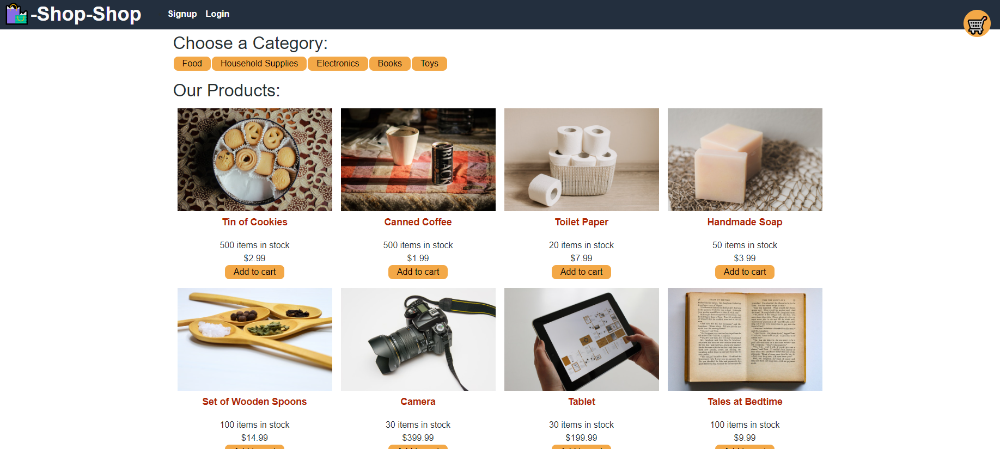

# shop-shop

## Description

This is a React e-commerce app that uses GraphQL on the back-end, along with Apollo Server and MongoDB via Mongoose. It also accesses global state using the React Context API. The main focus of my work was getting a shopping card up and running, including using indexedDB for persistence and Stripe to handle payments on the site.

A live version of the app can be found on [Heroku](https://shop-shop-stripe.herokuapp.com/).

## Table of Contents

- [Installation](#installation)
- [Usage](#usage)
- [Contributing](#contributing)
- [Questions](#questions)

## Installation

To install, simply clone the repo and packages.

## Usage

Launch from local with full functionality by using "npm i" for packages, followed by "npm run develop" to get it running in the browser.

## Contributing

The project is not accepting any contributions at this time.

## Questions

If you have any questions, feel free to contact me. Thanks!

Email: hulse.spencer@gmail.com

GitHub: [SpencerHulse](https://github.com/SpencerHulse)
